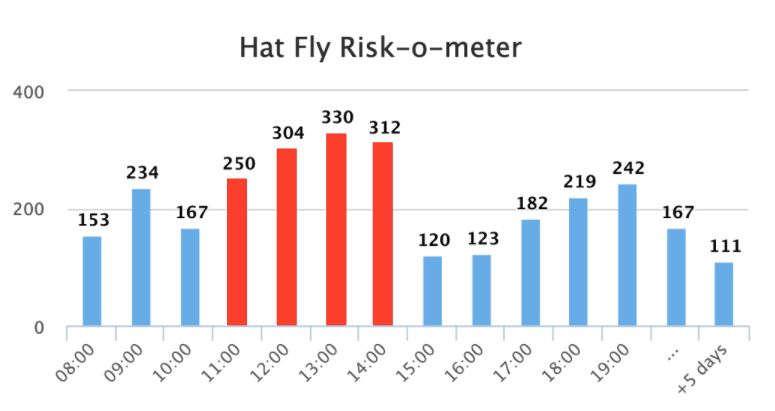

Elad: don't forget to add .env file
API_WEATHER_KEY = 5ZNGyYxAQ8YU77N6PhjNwSSfG93uGFMs
LOG_PATH = ./logs/app.log
VITE_WEATHER_LOCATION = Mount Washington, New Hampshire
VITE_WEATHER_LAT = 44.2705
VITE_WEATHER_LON = -71.30325
VITE_BACKEND_PORT = 4002
VITE_BAKEND_HOST = http://localhost
VITE_THRESHOLD = 8


# Fullstack Coding Challenge: The Cat in the Hat


> the sun did not shine.  
> it was too wet to play.  
> so we sat in the house.  
> all that cold, cold, wet day.

[The cat in the hat, Dr. Seuss.](http://paulandlizdavies.com/poems/cat.htm)

### Imagine you’re standing on the summit of Mt. Washington, New Hampshire, USA, two days from now, with a hat on your head. When would be a good time to take it off before it blows away? 🌬️

Your task is to answer this question using **Tomorrow.io's Weather API** by building a fullstack application that helps predict when the hat might take flight.

## 🔧 Preparation Steps

If this is an online interview, please complete the following **before the interview**.

### Setup

1. Download the repository
2. Ensure you’re using **Node.js v22.x**:

- If you have `nvm` installed, run:
  ```bash
  nvm install
  nvm use
  ```

3. Run the project with:
   ```bash
   npm i
   npm start
   npm run start-api
   ```

### API Access

This challenge relies on Tomorrow.io's [Weather Forecast API](https://docs.tomorrow.io/reference/weather-forecast). Please familiarize yourself with it before the interview.

Use the following API key to access the service: `5ZNGyYxAQ8YU77N6PhjNwSSfG93uGFMs`

Example:

```bash
curl 'https://api.tomorrow.io/v4/weather/forecast?location=Mt.%20Washington,%20New%20Hampshire,%20USA&apikey=5ZNGyYxAQ8YU77N6PhjNwSSfG93uGFMs'
```

## 🎩 Challenge Overview

We’ve provided a starter repository to help you get going. **Please use this repo as a base for your solution.** Forking is disabled, so you’ll need to create a new repository and copy the code manually.

### Backend Requirements

- Create a web service that fetches weather data from Tomorrow.io’s API, for Mt. Washington.
- Note that the suggested endpoint gives you all kinds of weather parameters, but you should focus on the wind speed.
- The service should determine the time when the wind conditions could cause the hat to fly off.
- You can decide about the threshold for the wind speed, for when the hat might fly off. Take into account the current conditions of the wind speed. For example, if the wind speed values are: `[23,20,19,22,30,31,39,24,22]`, define the threshold as `25`, so that some of the values will be below and some will be above.
- The timeline granularity should be hourly (e.g., 1 hour intervals), not minutely.

### Frontend Requirements

- Build a simple web application that displays a time-based graph of the weather parameter you are monitoring.
- The graph should visually indicate when the risk of the hat flying off is high, by highlighting the relevant time slots (see the mockup below)
- There should be a refresh button to fetch the latest data from the server.

See this mockup for inspiration to the graph design (the threshold here would be >250):


### For Home Assignments Only

If you’re completing this challenge as a take-home assignment:

1. **Upload your solution to a private GitHub repository** and share access with `cc-code-challenge`.
2. Make sure the app runs with:
   ```bash
   npm install
   npm start
   npm run start-api
   ```
3. **Bonus:** Deploy your application using a service like `Heroku`, `Vercel`, `AWS`, `Netlify`, or any other hosting platform.

## 📋 Guidelines

- Ensure your application meets the product requirements described above.
- You’re free to use any libraries or frameworks you find helpful.
- Your web service should follow RESTful conventions. For inspiration, you can check out https://restfulapi.net/.
- The frontend should be a single-page application (SPA) with a focus on user experience, performance, and design.
- Pay attention to clean code, software design, and maintainability. We value principles like [SOLID](https://en.wikipedia.org/wiki/SOLID), clear naming, and well-structured code.
- API thinking - Design a good contract between the server and the client, good API for the UI component, etc.
- Write your code as if it were intended for production deployment.

## 🔍 Evaluation Criteria

We’ll be looking at:

- Functionality – does the app work as expected?
- Code quality – is it clean, well-structured, maintainable, easy to understand?
- Design – does the solution demonstrate good software architecture?
- User experience – is the frontend intuitive and responsive?
- Bonus – if you’ve deployed your solution, we’ll review the live version.

## ❓ Questions

If you have any questions during the challenge, don’t hesitate to contact us.

### Good Luck!

**🚀 The Tomorrow.io Engineering Team**
